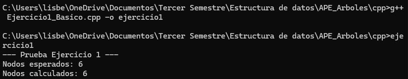
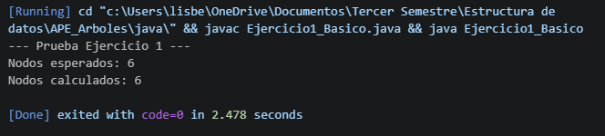
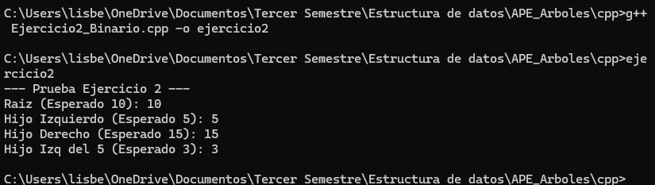
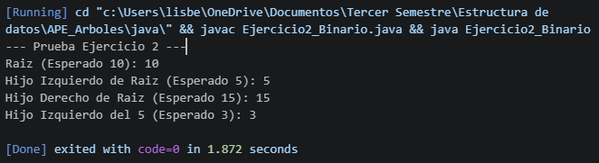
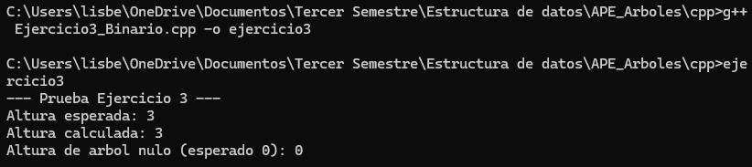
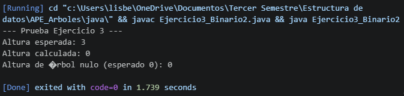
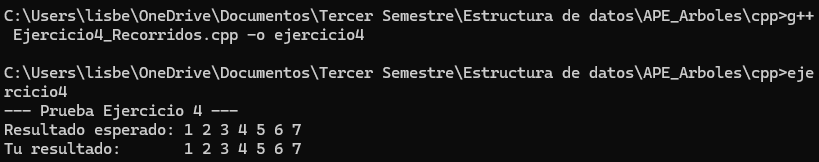
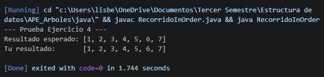
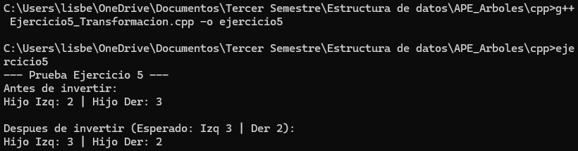
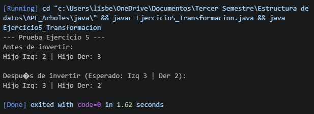

# Práctica de Estructuras de Datos: Árboles

El objetivo de este repositorio es proporcionarles un entorno práctico donde puedan aplicar los conceptos teóricos vistos en clase relacionados con árboles N-arios, árboles binarios, recorridos y transformaciones.

## Objetivos de Aprendizaje

Al completar estos ejercicios, serán capaces de:
1. Comprender y manipular la estructura básica de nodos con múltiples hijos y nodos binarios.
2. Implementar la lógica de inserción en un Árbol Binario de Búsqueda (BST).
3. Utilizar la recursividad para calcular métricas estructurales, como la profundidad máxima.
4. Extraer datos mediante recorridos estándar (In-Order).
5. Modificar la estructura subyacente de los punteros para transformar un árbol.

## Estructura del Repositorio

El repositorio contiene 5 ejercicios, cada uno debe ser hecho en c++ y java

1. Ejercicio 1: Árboles Básicos (Conteo de nodos en árboles N-arios).
2. Ejercicio 2: Árbol Binario (Inserción en BST).
3. Ejercicio 3: Árbol Binario (Cálculo de profundidad máxima).
4. Ejercicio 4: Recorridos (Implementación de In-Order).
5. Ejercicio 5: Transformación (Inversión o árbol espejo).

## Instrucciones para el Desarrollo

1. Dentro de cada archivo encontrarán la estructura básica de las clases (o structs) y la definición de un método específico que deben completar. 
2. Localicen el comentario `TODO: Implementa tu lógica aquí`. Esa es la única sección del código que necesitan modificar.
3. No es necesario modificar el método `main`. Este método ya contiene la construcción de un árbol de prueba y las impresiones necesarias para validar que su algoritmo funciona correctamente.
4. Su objetivo es lograr que, al ejecutar el código, los resultados calculados coincidan con los resultados esperados impresos en la consola.

## Lenguajes Utilizados

- C++
- Java

## Temas Aplicados

- Árboles N-arios
- Árboles Binarios
- Árboles BST
- Recursividad
- Recorridos de árboles
- Transformación de árboles

## Ejercicio 1 – Conteo de nodos en árbol N-ario

### Explicación

Se implementó un método recursivo capaz de recorrer un árbol N-ario y contar todos sus nodos. La función utiliza un caso base para validar si el nodo es nulo y posteriormente recorre cada hijo acumulando el total de nodos encontrados.

### Resultado en C++

### Resultado en Java

## Ejercicio 2 – Inserción en Árbol Binario de Búsqueda BST

### Explicación

Se desarrolló la lógica de inserción en un Árbol Binario de Búsqueda. El algoritmo compara el valor ingresado con el nodo actual para decidir si debe insertarse en el subárbol izquierdo o derecho.

### Resultado en C++

### Resultado en Java

## Ejercicio 3 – Cálculo de altura del árbol

### Explicación

Se implementó un algoritmo recursivo para calcular la altura máxima de un árbol binario. La solución obtiene la altura de ambos subárboles y utiliza la función máxima para determinar la profundidad total.

### Resultado en C++

### Resultado en Java

## Ejercicio 4 – Recorrido In-Order

### Explicación

Se implementó el recorrido In-Order utilizando recursividad. El algoritmo sigue el orden: subárbol izquierdo, raíz y subárbol derecho. En un BST, este recorrido permite obtener los valores ordenados.

### Resultado en C++

### Resultado en Java

## Ejercicio 5 – Transformación de árbol espejo

### Explicación

Se desarrolló un método para invertir un árbol binario creando su versión espejo. La transformación se realiza intercambiando los hijos izquierdo y derecho de cada nodo utilizando recursividad.

### Resultado en C++

### Resultado en Java

## Conclusiones

- Se logró aplicar correctamente conceptos fundamentales de árboles binarios y árboles N-arios utilizando C++ y Java.
- Laursividad permitió resolver problemas relacionados con recorridos, conteo de nodos, altura y transformaciones estructurales.
- Los ejercicios ayudaron a comprender mejor el funcionamiento interno de los árboles y su importancia en estructuras jerárquicas y algoritmos de búsqueda.

## Uso de GitHub e Inteligencia Artificial

### Uso de GitHub

GitHub fue utilizado como herramienta de control de versiones para organizar el desarrollo de la práctica, almacenar el código fuente y registrar los avances realizados mediante commits.

### Uso de Inteligencia Artificial

La inteligencia artificial fue utilizada como apoyo académico para reforzar conceptos teóricos, comprender errores de compilación, mejorar la documentación del código y orientar la implementación de los ejercicios relacionados con árboles y recursividad.